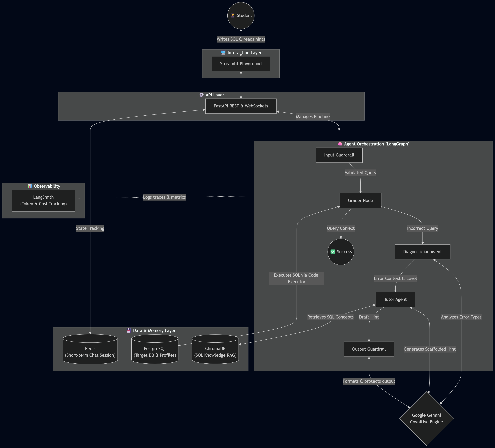

# 🎓 Intelligent SQL Tutoring System

A **multi-agent AI tutoring system** for personalized SQL education, built with LangGraph, FastAPI, and Google Gemini. Provides automated query grading, SQL error diagnosis, and adaptive pedagogical hints through a 4-level scaffolding system.

> **Master's Thesis Project** — An experimental platform for studying the effectiveness of AI-driven pedagogical scaffolding in SQL education.

## Architecture



### Component Breakdown
1. **Interaction Layer (Streamlit)**: An interactive frontend playground where students can type SQL queries, view real-time chat history, and see long-term memory updates.
2. **API & Session Layer (FastAPI & Redis)**: Handles robust networking, bridging the UI and the backend logic. It maintains short-term conversational session memory using Redis.
3. **Agent Orchestration Layer (LangGraph)**: The multi-agent pipeline resolving student inquiries:
    - **Grader Node**: Executes the user's query safely against the PostgreSQL database. If an error or incorrect result is returned, it passes the context to the next stage.
    - **Diagnostician Agent**: Uses Gemini to categorize the SQL failure (e.g., `syntax_error`, `grouping_error`) determining precisely what concept the student is misunderstanding.
    - **Tutor Agent**: Synthesizes the diagnosed error, the current problem's constraints, and appropriate pedagogical scaffolding (Levels 1-4) to generate a supportive, instructional hint.
4. **Cognitive & RAG Layer (Gemini & ChromaDB)**: Google Gemini acts as the main cognitive engine, evaluating queries and drafting hints. To prevent hallucinations and enforce specific SQL syntaxes, ChromaDB is utilized as a vector database for Retrieval-Augmented Generation (RAG).

## SQL Error Taxonomy

| Error Type         | Description                                  | Example                                        |
|-------------------|----------------------------------------------|------------------------------------------------|
| `syntax_error`     | Malformed SQL                                | `SELCT * FROM employees`                       |
| `column_error`     | Wrong/misspelled column name                 | `SELECT employee_name FROM ...`                |
| `relation_error`   | Wrong/misspelled table name                  | `FROM employes`                                |
| `join_error`       | Incorrect or missing JOIN condition          | `FROM orders, customers` (no ON)               |
| `aggregation_error`| GROUP BY / HAVING misuse                     | `SELECT name, COUNT(*) FROM ... GROUP BY dept` |
| `subquery_error`   | Subquery returns wrong shape                 | `WHERE id = (SELECT id FROM ...)` (multi-row)  |
| `type_error`       | Data-type mismatch                           | `WHERE salary = 'abc'`                         |
| `ambiguity_error`  | Ambiguous column in multi-table query        | `SELECT id FROM t1 JOIN t2 ...`                |
| `logic_error`      | Query runs but returns wrong results         | Wrong WHERE condition or missing JOIN          |
| `timeout_error`    | Query too slow (Cartesian product, etc.)     | `FROM orders, products` (no JOIN ON)           |

## Hint Scaffolding Levels

| Level | Name       | Description                            | Example                                          |
|-------|------------|----------------------------------------|--------------------------------------------------|
| 1     | Attention  | Point to the problematic SQL clause    | "Look at your JOIN clause"                       |
| 2     | Category   | Explain the SQL error type             | "Every column in SELECT must be in GROUP BY..."  |
| 3     | Concept    | Show a similar SQL example             | "Here's how a similar JOIN works: ..."           |
| 4     | Solution   | Provide fill-in-the-blanks SQL template| `SELECT ___ FROM ___ JOIN ___ ON ___`            |

## Quick Start

### Prerequisites
- Python 3.11+
- Docker & Docker Compose
- Google API Key (Gemini)
- OpenRouter API Key (LLM-as-a-judge evaluation)

### 1. Clone & configure
```bash
cd d:\Inte_\intelligent-tutor
copy .env.example .env
# Edit .env and add your GOOGLE_API_KEY and OPENROUTER_API_KEY
# (Optional) Add LANGSMITH_API_KEY for LLM token cost & tracing
```

### 2. Start databases
```bash
docker-compose up -d
```

### 3. Install dependencies
```bash
python -m venv .venv
.venv\Scripts\activate  # Windows
pip install -r backend/requirements.txt
```

### 4. Initialize & seed database
```bash
python -m backend.db.seed
```

### 5. Start the server
```bash
uvicorn backend.main:app --reload
```

### 6. Start the AI Tutor Playground (Streamlit)
Open a new terminal, activate the virtual environment, and run the Streamlit frontend. This interactive sandbox lets you execute SQL, generate hints, and visualize the system's Short-term (Redis) and Long-term (Chroma) memory live:
```bash
streamlit run frontend/app.py
```
*Note: Ensure the FastAPI backend from step 5 is running simultaneously.*

### 7. Open API docs
Visit [http://localhost:8000/docs](http://localhost:8000/docs) for the Swagger UI.

## API Endpoints

| Method | Path                 | Description                    |
|--------|----------------------|--------------------------------|
| GET    | `/api/health`        | Health check                   |
| GET    | `/api/problems`      | List all SQL problems          |
| GET    | `/api/problems/{id}` | Get problem with test queries  |
| POST   | `/api/submit`        | Submit SQL → grade + hints     |
| WS     | `/ws/session/{id}`   | Real-time session updates      |

## Seed Problems

| # | Title                         | Topic             | Difficulty |
|---|-------------------------------|--------------------|-----------|
| 1 | Basic SELECT — Employee Names | SELECT basics      | Easy      |
| 2 | WHERE — High Salary           | WHERE filtering    | Easy      |
| 3 | INNER JOIN — Employees & Depts| JOINs              | Medium    |
| 4 | GROUP BY — Dept Avg Salary    | Aggregation        | Medium    |
| 5 | Subquery — Above-Average      | Subqueries         | Medium    |
| 6 | HAVING — Big Spender Customers| HAVING clause      | Hard      |

## Project Structure

```text
intelligent-tutor/
├── backend/
│   ├── agents/           # LangGraph agent node definitions
│   │   ├── diagnostician.py  # SQL error classifier
│   │   ├── tutor.py          # Hint generator
│   │   └── supervisor.py     # Pipeline orchestrator
│   ├── tools/            # LangGraph tools
│   │   ├── code_executor.py  # SQL executor (PostgreSQL)
│   │   ├── test_runner.py    # SQL result-set comparison
│   │   ├── error_classifier.py # SQL error taxonomy
│   │   └── hint_generator.py # SQL-specific hint scaffolding
│   ├── memory/           # Agent memory management
│   │   ├── long_term.py
│   │   ├── mastery.py
│   │   └── redis_session.py
│   ├── rag/              # Retrieval-Augmented Generation
│   │   ├── retriever.py
│   │   └── sql_knowledge.py
│   ├── evaluation/       # Performance evaluation & Judges
│   │   ├── eval_dataset.py
│   │   ├── ragas_evaluator.py
│   │   ├── run_evaluation.py
│   │   ├── llm_judge.py
│   │   └── run_eval_llm_judge.py
│   ├── db/               # Database layer
│   │   ├── models.py     # SQLAlchemy ORM models
│   │   ├── schemas.py    # Pydantic validation schemas
│   │   ├── database.py   # Async DB connection
│   │   └── seed.py       # Reference data + SQL problems
│   ├── api/              # FastAPI endpoints
│   │   ├── routes.py
│   │   └── websocket.py
│   ├── config.py         # App configurations
│   ├── guardrails.py     # Output formatting and protection
│   ├── llm.py            # LLM connection instances
│   └── main.py
├── tests/                # Pytest test suite
├── docker-compose.yml
├── .env.example
└── README.md
```

## Quickstart: AI Tutor Playground

Run the included Streamlit-based interactive UI to experiment with the SQL sandbox, observe hint generation, and view the AI's internal memory state (Redis & ChromaDB) in real-time.

1. **Start the FastAPI Backend**:
   ```bash
   python -m uvicorn backend.main:app
   ```

2. **Start the Streamlit Frontend** (in a new terminal):
   ```bash
   streamlit run frontend/app.py
   ```
   *Note: Ensure your Docker containers for PostgreSQL and Redis are running.*

## Running Tests & Evaluation

### Pytest Suite
```bash
# Tool tests (error classifier + hint generator — no DB needed)
pytest tests/test_tools.py -v

# API tests (requires PostgreSQL)
pytest tests/test_api.py -v

# All tests
pytest -v
```

### Evaluation Datasets
The pipeline evaluates hints against pre-defined error scenarios. You can dynamically define new subsets using a CSV evaluation dataset.
A script is included to help generate an evaluation CSV derived from your practice question CSVs:
```bash
python generate_eval_csv.py
```

### RAGAS Evaluation
Evaluates the accuracy of the Retrieval-Augmented Generation (RAG) components:
```bash
# Markdown output (uses internal hardcoded dataset by default)
python -m backend.evaluation.run_evaluation

# Run with a custom CSV dataset
python -m backend.evaluation.run_evaluation --dataset-csv "sql-problem/Evaluation-Dataset-Bike-shop-2025.csv"

python -m backend.evaluation.run_evaluation --dataset-csv "sql-problem/Evaluation-Dataset-Bike-shop-2025.csv" --output csv --csv-path results_ragas_bike.csv 

# CSV export
python -m backend.evaluation.run_evaluation --output csv --csv-path results_ragas.csv 
```

### LLM-as-a-Judge Evaluation
Uses a strict evaluator (via OpenRouter's `gpt-oss-120b` or similar model) to assess hint instructional quality, pedagogical compliance, and solution leakage prevention:
```bash
# Markdown output (uses internal hardcoded dataset by default)
python -m backend.evaluation.run_eval_llm_judge

# Run against a custom CSV dataset
python -m backend.evaluation.run_eval_llm_judge --dataset-csv "sql-problem/Evaluation-Dataset-Bike-shop-2025.csv" --output markdown

python -m backend.evaluation.run_eval_llm_judge --dataset-csv "sql-problem/Evaluation-Dataset-Bike-shop-2025.csv" --output csv --csv-path judge_results_bike.csv

# CSV export
python -m backend.evaluation.run_eval_llm_judge --output csv --csv-path judge_results.csv
```

## License

This project is part of a master's thesis and is for academic use.
